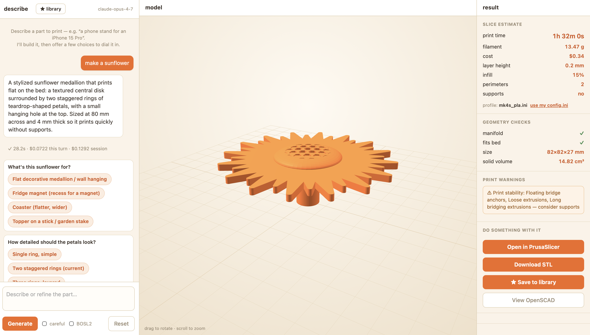

# Prusa + Claude design tool

Describe a part in plain language → Claude writes parametric OpenSCAD → see it
in 3D → tune it with sliders → get real PrusaSlicer print estimates → open it in
PrusaSlicer to print. Save your designs to a local library and come back to them.

For people who already reach for a **Prusa printer** and **Claude** as go-to tools.



## Prerequisites (one-time)

- **Python 3.10+**
- **OpenSCAD** — `brew install --cask openscad@snapshot` (renders the geometry).
  The snapshot has the fast **Manifold** backend; the old stable `openscad`
  (2021.01) works but is dramatically slower on complex parts.
- **PrusaSlicer** — from [prusa3d.com](https://prusa3d.com) (for real slice estimates + "Open in PrusaSlicer")
- **An Anthropic API key** — `export ANTHROPIC_API_KEY=sk-ant-...`

> macOS-focused (paths assume Homebrew + `/Applications`). On Linux/Windows it
> still runs — install OpenSCAD + PrusaSlicer and set `OPENSCAD_BIN` / `PRUSA_BIN`.

## Run

```bash
export ANTHROPIC_API_KEY=sk-ant-...
./run.sh
```

`run.sh` creates the virtualenv, installs dependencies, fetches the BOSL2
library, checks your prerequisites, and opens the app at
**http://localhost:8000**. Re-running it is fast (everything is cached).

## What you get

- **Describe → see → tune → slice → print**, all in one window.
- **Guided questions + suggestions** — click to refine, like Claude does.
- **Real numbers** — print time / filament grams / cost from PrusaSlicer, plus
  its own print-stability warnings. Upload your exported `config.ini` for exact
  per-printer numbers ("use my config.ini").
- **Geometry checks** — manifold, fits-the-bed, volume — caught before slicing.
- **Sliders** — every key dimension is tunable; drag and the model re-renders
  (no API call, no cost).
- **Known dimensions** — name a phone, an M3 screw, a Raspberry Pi and it uses
  the real measurements instead of guessing.
- **Library** — save designs (with thumbnails) and reload them to keep tweaking.
- **BOSL2 toggle** — opt-in real threads / gears / screws.

## Configuration (optional env vars)

| Var | Purpose |
|---|---|
| `ANTHROPIC_API_KEY` | required |
| `PRUSA_MODEL` | Claude model (default `claude-opus-4-7`) |
| `PRUSA_PROFILE` | path to a PrusaSlicer `config.ini` for real grams/cost |
| `PRUSA_BIN` / `OPENSCAD_BIN` | override binary locations if auto-detect misses |
| `PORT` | server port (default 8000) |

## Layout

- `app/` — the web app: `server.py` (FastAPI), `slicer.py`, `analysis.py`,
  `customizer.py`, `reference.py`, `library.py`, `static/index.html`.
- `spike/` — the generation engine: `prompts.py` (the system prompt / IP),
  `generate.py`, `compile.py`.
- `libs/BOSL2` — fetched on first run.
- `app/designs/` — your saved library (created locally; not in the repo).

## License

Source-available under the **PolyForm Noncommercial License 1.0.0** (see
[LICENSE.md](LICENSE.md)). Free to use, modify, and share for **personal and
noncommercial** purposes. **Commercial use requires a separate license** —
contact ONUSKA & BROWN Technologies.

© 2026 Ian Onuska / ONUSKA & BROWN Technologies
